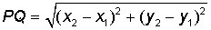
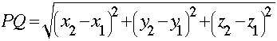

# first Class Functions
=======================


-----------------------------------------------------------------------------------------------------

## Features

- **Docstring Conventions** [PEP 257](https://www.python.org/dev/peps/pep-0257/)

- **Function Annotations** [PEP 3107](https://www.python.org/dev/peps/pep-3107/)


## Lambda

Small anonymous functions can be created with the lambda keyword. This function returns the sum of its two arguments: lambda a, b: a+b. Lambda functions can be used wherever function objects are required. They are syntactically restricted to a single expression. Semantically, they are just syntactic sugar for a normal function definition. Like nested function definitions, lambda functions can reference variables from the containing scope.

lambda [parameter list]: expression


-----------------------------------------------------------------------------------------------------

## FUNCTION INSTROSPECTION

Introspection is an act of self examination. In computer programming, introspection is the ability to determine type or properties of objects at runtime. Python programming language has a large support of introspection. Everything in Python is an object. Every object in Python may have attributes and methods. By using introspection, we can dynamically inspect Python objects.


- Functions and first-class objects have attributes:

- **__doc__**
- **__annotations__**

- *dir()* is a built-in function that, given an object as an argument, will return a list of valid
attributes for that object

- Function Attributes: __name__, __defaults__, __kwdefaults__,  __code__

- **__name__** -> Name of function
- **__defaults__** -> tuple containing positional parameter defau
- **__kwdefaults** -> dictionary containing keyword-only parameter defaults
- ** __code__** -> object itself has various properties

* *co_varnames* -> parameter and local variables
* *co_argcount* -> number of parameters

-----------------------------------------------------------------------------------------------------

## The Inspect Module

> [DOCS](https://docs.python.org/3/library/inspect.html)

- *ismethod(obj)* --> Checks if is a method of a Class
- *isfunction(obj)* --> Check if is a function (not of a class)
- *isroutine(obj)* --> Returns True either if is a function or method
- *inspect.getcomments(my_func)*
- *inspect.signature(my_func)* --> Signature instance

OOP:

Instance methods are bound to the instance of a class (not the class itself)

Class methods are bound to the class, not instances

Static methods are no bound either to the class or its instances

-----------------------------------------------------------------------------------------------------

## MAP FUNCTION

Make an iterator that computes the function using arguments from
each of the iterables.  Stops when the shortest iterable is exhausted.

Return an iterator that applies function to every item of iterable, yielding the results. If additional iterable arguments are passed, function must take that many arguments and is applied to the items from all iterables in parallel. With multiple iterables, the iterator stops when the shortest iterable is exhausted. For cases where the function inputs are already arranged into argument tuples, see [itertools.starmap()](https://docs.python.org/3/library/itertools.html#itertools.starmap).

- [DOCS](https://docs.python.org/3/library/functions.html#map)


- map(func, *iterables)

*iterables → a variable number of iterable objects
func → some function that takes as many arguments as there are iterable
objects passed to iterable

the iterator stops as soon as one of the iterables has been exhausted
so, unequal length iterables can be used

```

l = [2, 3, 4] 

def sq(x):
    return x**2

list(map(sq, l))
>>> [4, 9, 16]

list(map(lambda x: x**2, l))

>>> [4, 9, 16]

result = []
for x in l:
    result.append(x**2) --> [4, 9, 16]

[x**2 for x in l] --> [4, 9, 16]

```

```
l1 = [1, 2, 3]
l2 = [10, 20, 30]
list(map(lambda x, y: x + y, l1, l2)) --> [11, 22, 33]


```


-----------------------------------------------------------------------------------------------------

## FILTER FUNCTION

Return an iterator yielding those items of iterable for which function(item)
is true. If function is None, return the items that are true.

- [DOCS](https://docs.python.org/3/library/functions.html#filter)


Construct an iterator from those elements of iterable for which function returns true. iterable may be either a sequence, a container which supports iteration, or an iterator. If function is None, the identity function is assumed, that is, all elements of iterable that are false are removed.

Note that filter(function, iterable) is equivalent to the generator expression:
```
(item for item in iterable if function(item))
```
if function is not None and 
```
(item for item in iterable if item)
``` 
if function is None.

See [itertools.filterfalse()](https://docs.python.org/3/library/itertools.html#itertools.filterfalse) for the complementary function that returns elements of iterable for which function returns false.

- filter(func, iterable)

iterable → a single iterable
func → some function that takes a single argument

filter(func, iterable) will then return an iterator that contains all the
elements of the iterable for which the function called on it is Truthy

If the function is None, it simply returns the elements of iterable that are Truthy

```
l = [1, 2, 3, 4]
list(filter(lambda n: n% 2 == 0, l)) --> [2, 4]
[x for x in l if x % 2 == 0 ] --> [2, 4]

```
# [<expression1> for <varname> in <iterable> if <expression2>]
==============================================================


```
l = range(10)
list(filter(lambda y: y < 25, map(lambda x: x**2, l))) → [0, 1, 4, 9, 16]

[x**2 for x in range(10) if x**2 < 25] → [0, 1, 4, 9, 16]

```


-----------------------------------------------------------------------------------------------------

## THE ZIP FUNCTIN

- zip(*iterables)
- [DOCS](https://docs.python.org/3/library/functions.html#zip)

Make an iterator that aggregates elements from each of the iterables.

Returns an iterator of tuples, where the i-th tuple contains the i-th element from each of the argument sequences or iterables. The iterator stops when the shortest input iterable is exhausted. With a single iterable argument, it returns an iterator of 1-tuples. With no arguments, it returns an empty iterator. Equivalent to:
```
def zip(*iterables):
    # zip('ABCD', 'xy') --> Ax By
    sentinel = object()
    iterators = [iter(it) for it in iterables]
    while iterators:
        result = []
        for it in iterators:
            elem = next(it, sentinel)
            if elem is sentinel:
                return
            result.append(elem)
        yield tuple(result)
```

zip() should only be used with unequal length inputs when you don’t care about trailing, unmatched values from the longer iterables. If those values are important, use [itertools.zip_longest()](https://docs.python.org/3/library/itertools.html#itertools.zip_longest) instead.

**zip() in conjunction with the * operator can be used to unzip a list:**

```
>>> x = [1, 2, 3]
>>> y = [4, 5, 6]
>>> zipped = zip(x, y)
>>> list(zipped)
[(1, 4), (2, 5), (3, 6)]
>>> x2, y2 = zip(*zip(x, y))
>>> x == list(x2) and y == list(y2)
True
```


```
zip(l1, l2) → [(1, 10), (2, 20), (3, 30)]
[x + y for x, y in zip(l1, l2)] → [11, 22, 33]


```
-----------------------------------------------------------------------------------------------------

## REDUCING FUNCTION

These are functions that recombine an iterable recursively, ending up with a single return value.

Also called **accumulators**, **aggregators**, or **folding functions**.

- min [DOCS](https://docs.python.org/3/library/functions.html#min)

Return the smallest item in an iterable or the smallest of two or more arguments.

- max [DOCS](https://docs.python.org/3/library/functions.html#max)

Return the largest item in an iterable or the largest of two or more arguments.

- sum [DOCS](https://docs.python.org/3/library/functions.html#sum)

Sums start and the items of an iterable from left to right and returns the total. The iterable’s items are normally numbers, and the start value is not allowed to be a string.

- any [DOCS](https://docs.python.org/3/library/functions.html#any)

Return True if any element of the iterable is true. If the iterable is empty, return False. 
- all [DOCS](https://docs.python.org/3/library/functions.html#all)

Return True if all elements of the iterable are true (or if the iterable is empty). 

### FUNCTOOL REDUCE FUNCTION

- [DOCS](https://docs.python.org/3.8/library/functools.html#functools.reduce)


Apply function of two arguments cumulatively to the items of iterable, from left to right, so as to reduce the iterable to a single value. For example: 
```
reduce(lambda x, y: x+y, [1, 2, 3, 4, 5])
```
Calculates: 
```
((((1+2)+3)+4)+5) 
```
The left argument, x, is the accumulated value and the right argument, y, is the update value from the iterable. If the optional initializer is present, it is placed before the items of the iterable in the calculation, and serves as a default when the iterable is empty. If initializer is not given and iterable contains only one item, the first item is returned.
```
def reduce(function, iterable, initializer=None):
    it = iter(iterable)
    if initializer is None:
        value = next(it)
    else:
        value = initializer
    for element in it:
        value = function(value, element)
    return value
```
See [itertools.accumulate()](https://docs.python.org/3.8/library/itertools.html#itertools.accumulate) for an iterator that yields all intermediate values.


-----------------------------------------------------------------------------------------------------

## PARTIAL FUNCTION

- [DOCS](https://docs.python.org/3/library/functools.html#functools.partial)

Return a new partial object which when called will behave like func called with the positional arguments args and keyword arguments keywords. If more arguments are supplied to the call, they are appended to args. If additional keyword arguments are supplied, they extend and override keywords. 

The partial() is used for partial function application which “freezes” some portion of a function’s arguments and/or keywords resulting in a new object with a simplified signature.

```

def my_func(a, b, c):
    print(a, b, c)

def fn(b, c):
    return my_func(10, b, c)

fn(20, 30) → 10, 20, 30

f = lambda b, c: my_func(10, b, c)

f(20, 30) → 10, 20, 30

from functools import partial

f = partial(my_func, 10)

f(20, 30) → 10, 20, 30

```

#### Use Cases

We tend to use partials in situation where we need to call a function that actually requires more parameters than we can supply.

Often this is because we are working with exiting libraries or code, and we have a special case.

-----------------------------------------------------------------------------------------------------
### NOTES

- To see if an object is callable, we can use the built-in function: callable

> [DOCS](https://docs.python.org/3/library/functions.html#callable)

Return True if the object argument appears callable, False if not. If this returns True, it is still possible that a call fails, but if it is False, calling object will never succeed. Note that classes are callable (calling a class returns a new instance); instances are callable if their class has a __call__() method.


- **Distance between two points in Cartesian plane**

- [Cartesian coordinate system](https://en.wikipedia.org/wiki/Cartesian_coordinate_system)
- [Euclidean distance](https://en.wikipedia.org/wiki/Euclidean_distance)

We use the Pythagoras Theorem to derive a formula for finding the distance between two points in 2- and 3- dimensional space. Let P = (x 1, y 1) and Q = (x 2, y 2) be two points on the Cartesian plane


Then from the Pythagoras Theorem we find that the distance between P and Q is



In a similar way, it can be proved that if P = (x 1, y 1, z1) and Q = (x 2, y 2, z2) are two points in the 3-dimensional space, the distance between P and Q is

