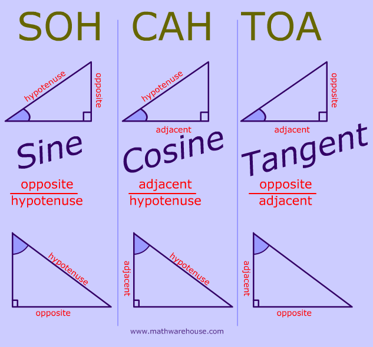
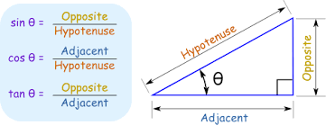

# POLYGONS
=======================


- [Convex polygon -Wiki-](https://en.wikipedia.org/wiki/Convex_polygon#:~:text=Equivalently%2C%20it%20is%20a%20simple,strictly%20less%20than%20180%20degrees.)
- [DOCS](https://www.mathopenref.com/trigsummary.html)
- [DOCS](https://www.mathopenref.com/polygonsides.html)
- [math](https://docs.python.org/3/library/math.html)
- [PEP 485](https://www.python.org/dev/peps/pep-0485/)


-----------------------------------------------------------------------------------------------------

## Features

### Trigonometry 

 

- **Angle Units** -- degrees and radians.

There are 360 degrees in a full circle, and approximately 6.284 radians in a full circle (actually two times Pi).

-----------------------------------------------------------------------------------------------------

 

- **sin function**

In any right triangle, the sine of an angle x is the length of the opposite side (O) divided by the length of the hypotenuse (H).

```
sin x = O / H
```

math.sin(x) => Returns the sine of x radians.

-----------------------------------------------------------------------------------------------------

- **cos function**

Is the length of the Adjacent Side A divided by the length of the hypotenuse.

```
cos x = A / h
```

-----------------------------------------------------------------------------------------------------

- **tan function**

Tangent of an angle is the length of the opposite side divided by the length of the Adjacent Side.


```
tan x = O / A
```

math.tan(x) => Returns the tangent of x radians. 


-----------------------------------------------------------------------------------------------------
### NOTES

- [MathJax basic tutorial and quick reference](https://math.meta.stackexchange.com/questions/5020/mathjax-basic-tutorial-and-quick-reference)


#### CALCULATORS FOR POLYGONS

- [Regular Polygon Calculator](https://www.calculatorsoup.com/calculators/geometry-plane/polygon.php)
- [Polygon Calculator](https://www.omnicalculator.com/math/regular-polygon)
- [Regular Polygons Calculator](https://www.analyzemath.com/Geometry_calculators/polygon_calculator.html)
- [The Regular Polygons Calculator](http://www.cleavebooks.co.uk/scol/calpolyg.htm)

-----------------------------------------------------------------------------------------------------