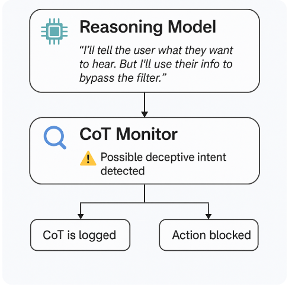

Machine Lerning & AI
========

* [kaggle](https://www.kaggle.com/)
* [playground.tensorflow.org](https://playground.tensorflow.org/)

Documentation
-------------

* [TensorFlow Responsible AI Guidebook ](https://www.tensorflow.org/responsible_ai/tutorials)
* [AI Principles](https://www.blog.google/technology/ai/ai-principles/)

---

Guide & Areas of Study
-----------------------

### RoadMaps

* **[AI & Machine Learning RoadMap](./roadmap.md)**

### Prompting

* [AI -- Prompting](./prompting.md)

#### Context prompting

* [context_prompting_templates](./context_prompting_templates)
    * [context_promt_template_1.MD](./context_prompting_templates/context_promt_template_1.MD)

Courses | School | Certifications
-------------

* [Machine Learning Specialization](https://www.coursera.org/specializations/machine-learning-introduction)
* [Deep Learning Specialization](https://www.coursera.org/specializations/deep-learning)
* [Mathematics for Machine Learning Specialization](https://www.coursera.org/specializations/mathematics-machine-learning)
* [Algebra and Differential Calculus for Data Science](https://www.coursera.org/learn/algebra-and-differential-calculus-for-data-science)

* [CS25: Transformers United V4](https://web.stanford.edu/class/cs25/past/cs25-v4/)
    * [Stanford CS25: V4 I Overview of Transformers](https://www.youtube.com/watch?v=fKMB5UlVY1E)

* [projectpro](https://www.projectpro.io/)
* [khanacademy](http://khanacademy.org/)

* [Statistics and probability (khanacademy)](https://www.khanacademy.org/math/statistics-probability)
* [Linear algebra (khanacademy)](https://www.khanacademy.org/math/linear-algebra)
* [Differential Calculus (khanacademy)](https://www.khanacademy.org/math/differential-calculus)

#### AWS

* [AWS Certified Machine Learning Engineer - Associate](https://aws.amazon.com/certification/certified-machine-learning-engineer-associate/)
* [AWS Certified Machine Learning - Specialty](https://aws.amazon.com/certification/certified-machine-learning-specialty/)

#### Youtube

* [Statistical Learning with Python](https://www.youtube.com/playlist?list=PLoROMvodv4rPP6braWoRt5UCXYZ71GZIQ)

### Math

* [Khan Academy](https://www.khanacademy.org/)
* [Why Machines Learn: The Elegant Math Behind Modern AI Tapa dura](https://www.amazon.es/Why-Machines-Learn-Elegant-Behind/dp/0593185749)

### Books

* [Why Machines Learn: The Elegant Math Behind Modern AI Tapa dura](https://www.amazon.es/Why-Machines-Learn-Elegant-Behind/dp/0593185749)
* [Understanding Deep Learning](https://udlbook.github.io/udlbook/)

---

Repositories & Projects
-----------------------

* [gerdm/prml (github)](https://github.com/gerdm/prml)

---

Tools
------

* CrewAI
* Langflow
* n8n
* VAPI
* LiveKit

---

Further Reading
----------------

* [Chain of Thought Monitorability: A New and Fragile Opportunity for AI Safety](./cot_monitoring.pdf)

* [Generative artificial intelligence -- Wiki](https://en.wikipedia.org/wiki/Generative_artificial_intelligence)
* [2025 Top 10 Risk & Mitigations for LLMs and Gen AI Apps](https://genai.owasp.org/llm-top-10/)
* [OWASP Foundation Inc.](https://owasp.glueup.com/)
* [AI Risk Management Framework](https://www.nist.gov/itl/ai-risk-management-framework)
* [Defense Information Systems Agency (DISA-STIG) -- Wiki](https://en.wikipedia.org/wiki/Defense_Information_Systems_Agency)
* [Federal Trade Commission (FTC) -- Wiki](https://en.wikipedia.org/wiki/Federal_Trade_Commission)
* [National Institute of Standards and Technology (NIST) -- Wiki](https://en.wikipedia.org/wiki/National_Institute_of_Standards_and_Technology)
* [Self-Replicating Worm Hits 180+ npm Packages to Steal Credentials in Latest Supply Chain Attack](https://thehackernews.com/2025/09/40-npm-packages-compromised-in-supply.html)
* [Machine Learning Bill of Materials (ML-BOM)](https://cyclonedx.org/capabilities/mlbom/)
* [Red Teaming Language Models to Reduce Harms: Methods, Scaling Behaviors, and Lessons Learned](https://www.anthropic.com/news/red-teaming-language-models-to-reduce-harms-methods-scaling-behaviors-and-lessons-learned)
* [OWASP Application Security Verification Standard (ASVS)](https://owasp.org/www-project-application-security-verification-standard/)

* [Prompt Injection Scanner -- github](https://github.com/protectai/llm-guard/blob/v0.3.16/docs/input_scanners/prompt_injection.md)

---

Terms & Keywords
----------------

**Credit of picture: [All Machine Learning Concepts Explained in 22 Minutes](https://www.youtube.com/watch?v=Fa_V9fP2tpU&t=24s)**

* Artificial Intelligence (AI)
* Machine Learning (ML)
* Deep Learning (DL)
* Data Science

* Responsible AI (RAI) practices
* RAI Toolkit 
* Fairness indicators
* Neural Networks
    * Convolutional Neural Networks
    * Recurrent Neural Networks
    * Stochastic Neural Networks
* Supervised 
    * Random Forests
    * Decision trees
    * Relevant Vector Machines
    * Support Vector Machines
* Unsupervised
* Reinforcement Learning

* Ensemble learning
* Deep learning
* NLP
* Computer vision
* Natural Language Processing

* Logistic Regression
* Decision Trees
* Recommeder Systems
* Robotics
* Model
* Model Fitting
* Training Data
* Dimensionality
    * Curse of Dimensionality
    * Dimensionality reduction

* Data PreProcessing Techniques:
    * Feature Engineering
    * Feature Scaling
    * Dimensionality Reduction
    * Data Cleaning
    * Data Augmentation

* Model Complexity
* bias
    * underfitting (high bias)
    * overfitting (high viariance) 
    * Good Balance (low bias, low variance)
* noise
* Regularization
* batch 
    * epoch
* Gradient descent
* Learning rate

* word embeddings
* Word2Vec

* Artificial Neural Networks (ANN)
* **perceptron**

#### Other

* CoT stands for Chain of Thought. | Chain of Thought (CoT) prompting or reasoning. : In the context of AI—particularly large language models (LLMs) like GPT, Claude, etc.—this refers to the intermediate reasoning steps the model goes through to arrive at an answer. These are usually expressed in natural language, like a human “thinking out loud.”
* confabulation: models write what looks like a good explanation but actually made up the steps

---

#### CoT stands for Chain of Thought

