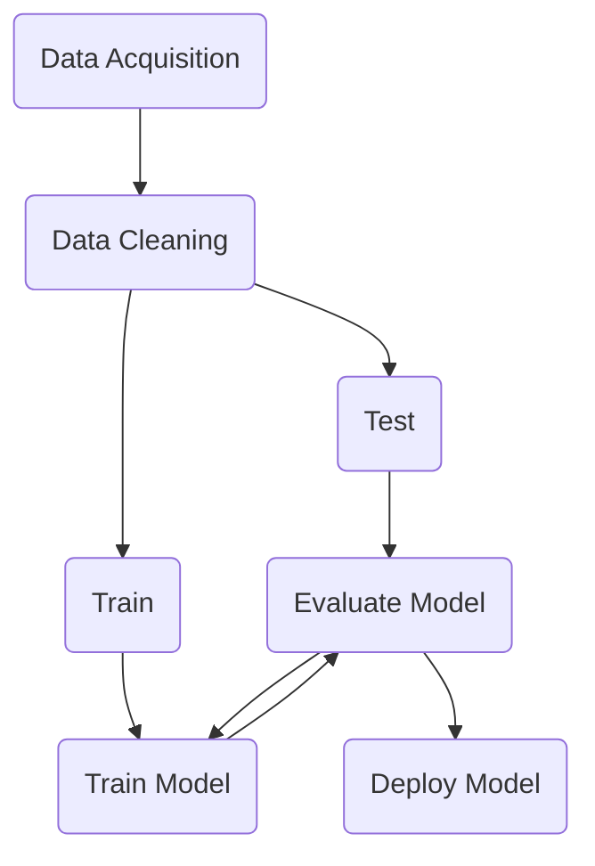
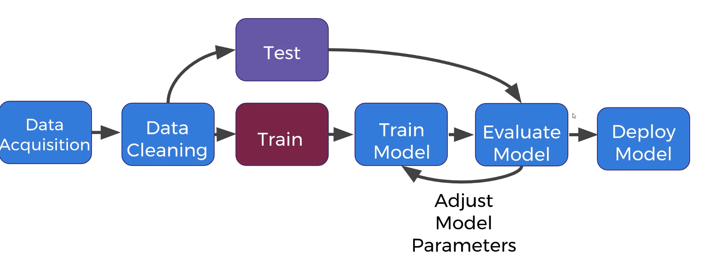
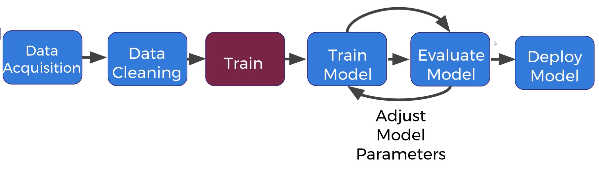
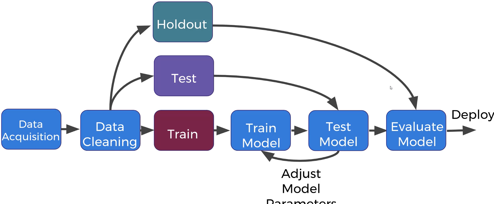

Complete Guide to TensorFlow for Deep Learning with PythonComplete
==================================================================

* Course: [Complete Guide to TensorFlow for Deep Learning with Python](https://www.udemy.com/course/complete-guide-to-tensorflow-for-deep-learning-with-python)

* Supervised (classification)
    * features: Height and Weights
    * Labeled data: Gender
    * Task: Given a person heigh and weight, predict gender

* Supervised (regression)
    * features: Square Footage, Rooms
    * Labeled data: Hourse Prioce
    * Task: Given a house's size and nunmber of rooms, predict the selling price

* Unsupervised (Clustering)
    * features: heights and weights of dog breeds
    * Unlabelled data
    * Task: CLuster together the data into similar groups. It is then up to the data scientist to interpret the clusters

* Reinforcement learning
    * Agent-Learning/Decision maker
    * Environment - What agent interacts with
    * Actions -- What the agent can do

### Evaluation

* supervised learning -- clasification eval
    * Accuracy | Recall | Precision
    * Accuracy | Correctly classified divided by total samples

* supervised learning -- regression eval
    * MAE | MSE | RMSE
    * all measurements of: on average how far off are you from the correct continous value

* unsupervised learning -- Evaluation
    * harder on 
    * cluster homogeneity, Rand index

### Deploy Model on New Incoming Data

### Unsupervised Learning

### hold out sets

