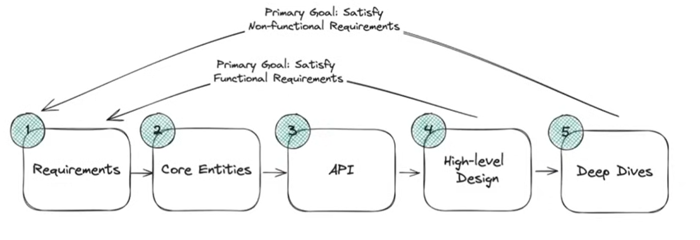

System Design
=============

Designs
-------

_These are just **MOCK** Designs done for training and fun purpooses!_

* [Designs](./designs/)
    * [Ticket Master](./designs//ticket_master/Ticket%20Master.md)
    * [Uber](./designs/uber/Uber.md)


Steps
-----



```bash
[requirements] -> [core entities] -> [API] -> [high-level design] -> [deep dives]
```

#### Requirements

* Functional Requirement:
    * Ask clarifications about the systems
    * List the core features | most important features
* Non-Functional Requirements
    * Avoid most common non-functional requirements (scalability ..reliability in general the whole system without an explaination)
    * which part actually requires more consistency >> availibility 
    * or _consitency for X but high availability for y_
    * _read >> write_
* Optional Out of scope: 
    * List things that you *explicity say are out-of-scope* and you intentionally skip (this shows that you are aware but yet you skip it)
    * GDPR Compliance
    * Auth
    * Fault Tolerance

#### Core entities

* Avoid go in details, you just list the entities name
* Entity_A
* Entity_B
* Entity_C
* ...

#### API

* list Restful (if restful) may endpoint 
* keep in count core entities -> resources 
* `GET /entity_a/:event_id -> Response` 
* `GET /search?query=abc&value=abac -> Response`
* Avoid put user data in payload (query or body) instead it should go in the header


#### high-level design

* Go 1 by 1 API request
* Discuss Database choice 
 

Videos & Courses
----------------

* [Kafka Deep Dive w/ a Ex-Meta Staff Engineer](https://www.youtube.com/watch?v=DU8o-OTeoCc) 
* [System Design Interview: Design Ticketmaster w/ a Ex-Meta Staff Engineer](https://www.youtube.com/watch?v=fhdPyoO6aXI)
* [System Design Interview: Design Uber w/ a Ex-Meta Staff Engineer](https://www.youtube.com/watch?v=lsKU38RKQSo)
