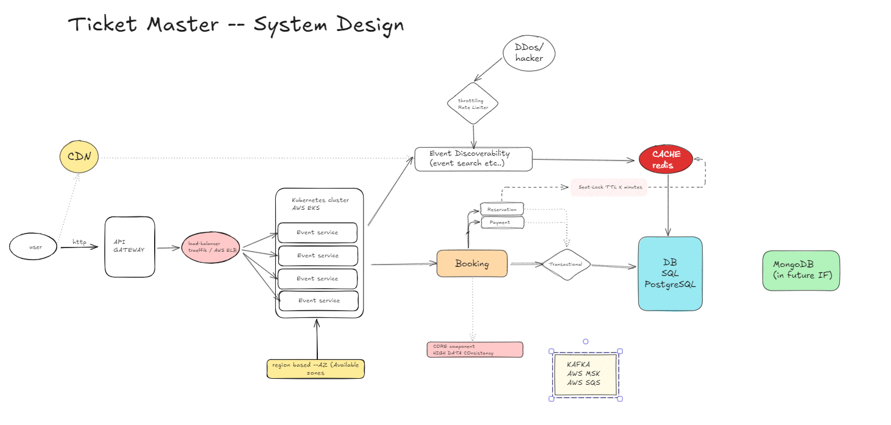

Ticket Master -- System Design
=============================




Requirements
------------

#### Core Requirements


* Create Events
* Search Events
* View Event 
* **Book Event** 
    * Seat-Lock | ticket
    * Purchase Ticket
* Partecipate Event
    * Responsibility split between App and actual venue (may not be always the same, is very Event specific)
    * View ticket
    * Validate ticket - "partecipate/attend" 


#### Non-Functional Requirements

* High Transactional especially doring Booking --> Seat-Lock / seat states -> purchase -> sold 
    * Rollbacks (for errors)
    * Seat-Lock timers | TTLS
    * Refounds 
* consistency > reliability: Booking 
* reliability > consistency: Event Search | Venue attendence / ticket validation  

##### Protocols / Architectures

* Event driven (pub/sub - Kafka | AWS SQS)
* HTTP -- RESTful APIs

#### Optional 

* Purchase History
* View previous tickets 
* Event review (after event partecipations) --- surveys
* Authorization

Core Entities
------------

* Event
    * Location (city, country)
    * Venue 
* User
* Seats
* Ticket 

API
---

RESTFul Apis at very high level

```bash
### Events
Search/List     GET      /api/v1/events?filter-query={...}                          -> []Events
View            GET      /api/v1/events/:event_id                                   -> Event

### Booking
Book            POST     /api/v1/booking Body{event_id: :event_id, ...}             -> Order 
Purchase        PATCH    /api/v1/booking/purchase Body{event_id: :event_id, ...}    -> Ticket

### Ticket
View            GET      /api/v1/tickets/:ticket_id                                 -> Ticket
Validate        PATCH    /api/v1/tickets/:ticket_id  Body{status: attended, ...}    -> 200
```
