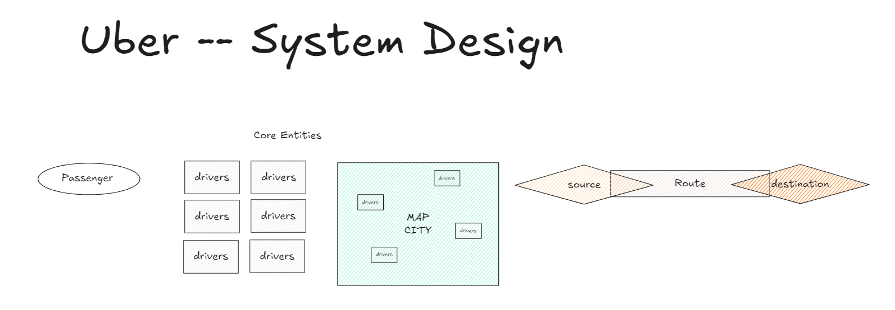
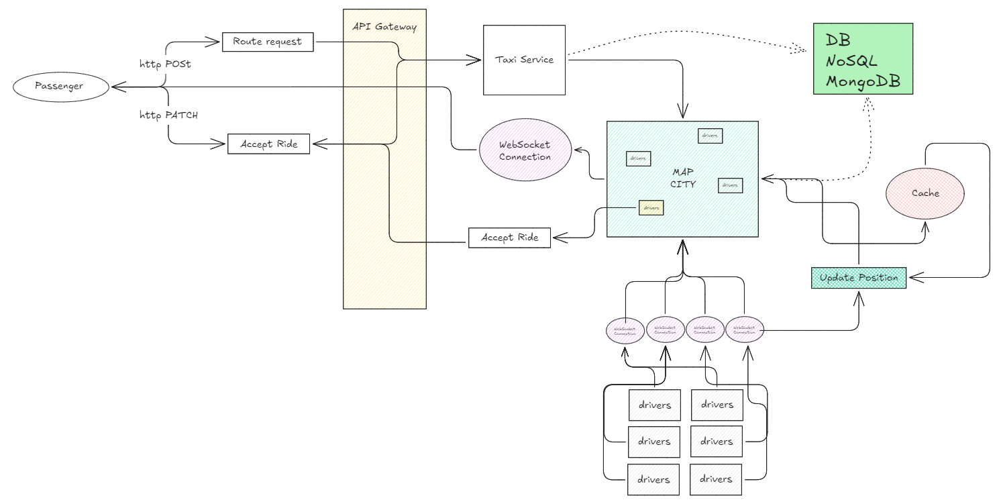
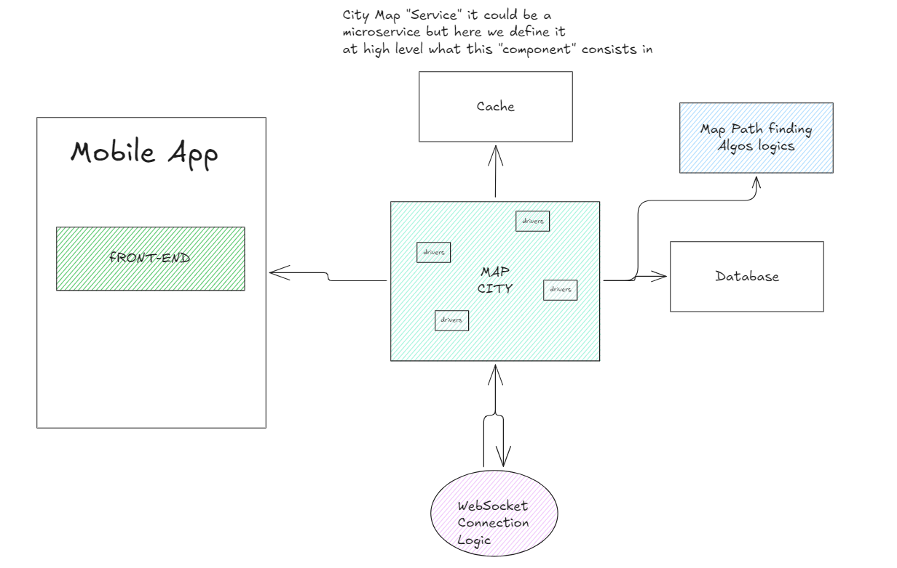

Uber -- System Design
=============================

* [System Design Interview: Design Uber w/ a Ex-Meta Staff Engineer](https://www.youtube.com/watch?v=lsKU38RKQSo)






### Core Requirements

* Driver 
    * -> free
    * -> occupied
    * -> accept ride
    * -> Update position
* Client
    * -> input source => destination
    * -> search driver
    * -> book driver
    * -> driver
* Map
    * Map view
    * City based?
    * Search Driver with an Area
    * Show metadata (such as distance, etc) 
    * Path algorithms: djkstra , A*, shortest path

### Infra / Non-functional Requirements

* map: availability >> consistency => We are ok to loose some data (i.e map position info) but it has to be available

#### Protocols

* HTTP Restful
* Websockets
* Event Driven


### Optional Requirements

* Driver review (1 -> 5 star)
* Auth
* Book history
* choose car type

### Core Entities

* Passenger | Person that does the booking
* Driver
* Map
* Booking | "order" 
* Route: start -> destination


### API

#### Restful APi

```bash
### Route
Create Route    PORT /api/v1/route  --> Route + WebSocket

### Map WebSocket

Passanger --> MAP <-- Driver
```